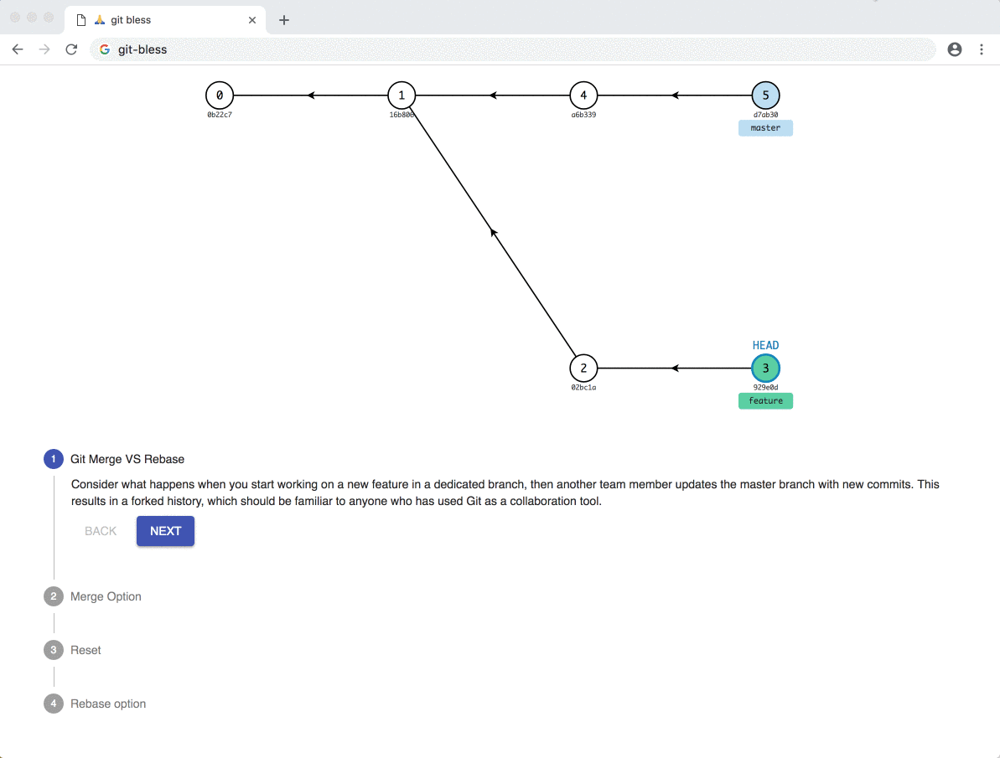

# 🙏 git-bless

Git cheat sheet explained with animation.

Using D3, React and Redux.

## Features

### Cheat Sheets

- [x] Merge vs Base
- [ ] Squash
- [ ] Copy a folder into another branch
- [ ] Copy a folder from another branch 
- [ ] rebase a local branch with remote master
- [ ] Undo a git push
- [ ] Revert commits
- [ ] Undo a git rebase

### Free playground

- [ ] Show how git works with a terminal-style input

## Links

### Redux
UI:
https://material-ui.com/demos/steppers/

Redux Thunk:
https://codepen.io/stowball/post/a-dummy-s-guide-to-redux-and-thunk-in-react

### D3
D3 selectionAll transition Explained:
http://bl.ocks.org/Kcnarf/9e4813ba03ef34beac6e

### Idea
A grip on Git. A simple interactive tutorial.
https://agripongit.vincenttunru.com/

