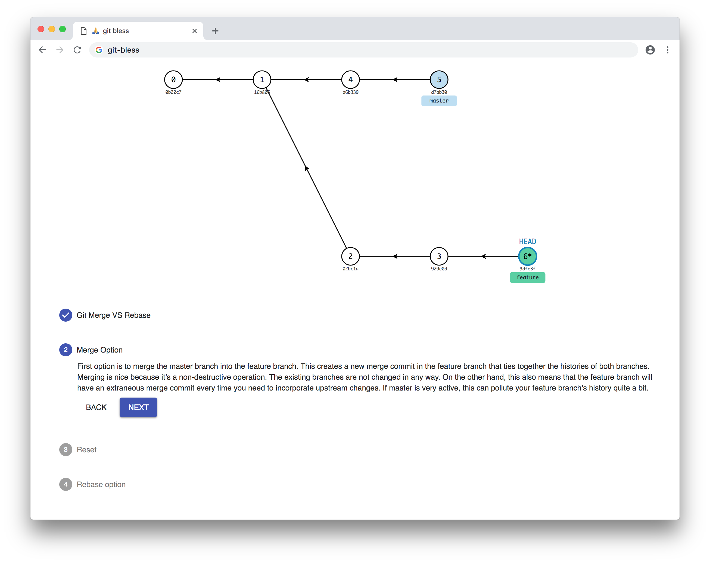

# 🙏 git-bless

Show how git works with animations.

D3, React and Redux.

## Links

### Redux
UI:
https://material-ui.com/demos/steppers/

Redux Thunk:
https://codepen.io/stowball/post/a-dummy-s-guide-to-redux-and-thunk-in-react

### D3
D3 selectionAll transition Explained:
http://bl.ocks.org/Kcnarf/9e4813ba03ef34beac6e

https://www.valentinog.com/blog/react-redux-tutorial-beginners/#React_Redux_tutorial_getting_to_know_the_Redux_store

### Idea
A grip on Git. A simple interactive tutorial.
https://agripongit.vincenttunru.com/

